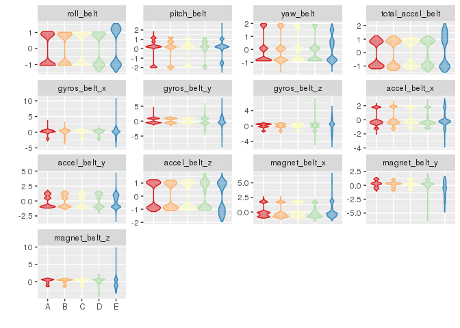
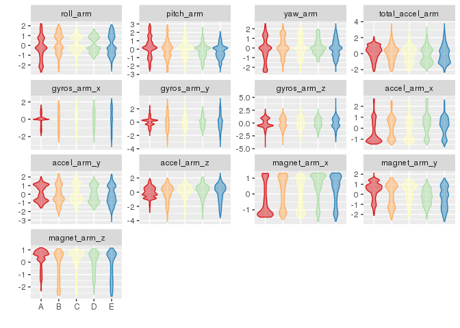
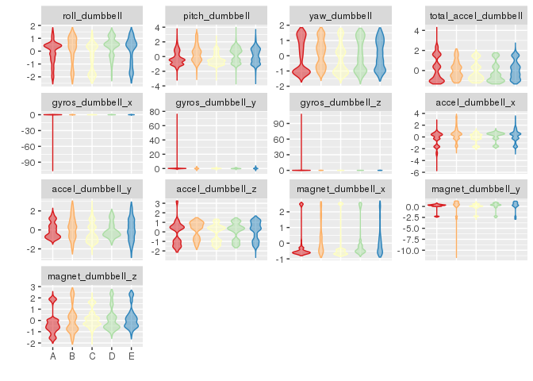
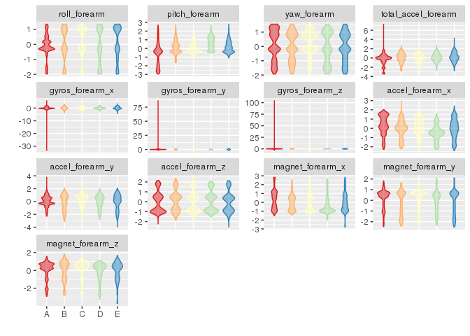

# Practical Machine Learning
Scott Zentz  
31 March 2016  


```
## Run time: 2016-04-03 01:00:13
## R version: R version 3.2.3 (2015-12-10)
```

> **Background**

> Using devices such as Jawbone Up, Nike FuelBand, and Fitbit it is now possible to collect a large amount of data about personal activity relatively inexpensively. These type of devices are part of the quantified self movement - a group of enthusiasts who take measurements about themselves regularly to improve their health, to find patterns in their behavior, or because they are tech geeks. One thing that people regularly do is quantify how much of a particular activity they do, but they rarely quantify how well they do it. In this project, your goal will be to use data from accelerometers on the belt, forearm, arm, and dumbell of 6 participants. They were asked to perform barbell lifts correctly and incorrectly in 5 different ways. More information is available from the website here: http://groupware.les.inf.puc-rio.br/har (see the section on the Weight Lifting Exercise Dataset). 


> **Data **

> The training data for this project are available here: 

> https://d396qusza40orc.cloudfront.net/predmachlearn/pml-training.csv

> The test data are available here: 

> https://d396qusza40orc.cloudfront.net/predmachlearn/pml-testing.csv

> The data for this project come from this source: http://groupware.les.inf.puc-rio.br/har. If you use the document you create for this class for any purpose please cite them as they have been very generous in allowing their data to be used for this kind of assignment. 


# Read in Data

Testing Dataset:


```r
require(data.table)
```

```
## Loading required package: data.table
```

```r
url <- "https://d396qusza40orc.cloudfront.net/predmachlearn/pml-testing.csv"
testData <- fread(url)
```

Training Dataset


```r
url <- "https://d396qusza40orc.cloudfront.net/predmachlearn/pml-training.csv"
trainData <- fread(url)
```


Our predictor candidates will be the belt, arm, dumbbell, and forearm variables because they do not have any missing values in the test dataset.


```r
isMissing <- sapply(testData, function (x) any(is.na(x) | x == ""))
isPredictor <- !isMissing & grepl("belt|[^(fore)]arm|dumbbell|forearm", names(isMissing))
predCandidates <- names(isMissing)[isPredictor]
predCandidates
```

```
##  [1] "roll_belt"            "pitch_belt"           "yaw_belt"            
##  [4] "total_accel_belt"     "gyros_belt_x"         "gyros_belt_y"        
##  [7] "gyros_belt_z"         "accel_belt_x"         "accel_belt_y"        
## [10] "accel_belt_z"         "magnet_belt_x"        "magnet_belt_y"       
## [13] "magnet_belt_z"        "roll_arm"             "pitch_arm"           
## [16] "yaw_arm"              "total_accel_arm"      "gyros_arm_x"         
## [19] "gyros_arm_y"          "gyros_arm_z"          "accel_arm_x"         
## [22] "accel_arm_y"          "accel_arm_z"          "magnet_arm_x"        
## [25] "magnet_arm_y"         "magnet_arm_z"         "roll_dumbbell"       
## [28] "pitch_dumbbell"       "yaw_dumbbell"         "total_accel_dumbbell"
## [31] "gyros_dumbbell_x"     "gyros_dumbbell_y"     "gyros_dumbbell_z"    
## [34] "accel_dumbbell_x"     "accel_dumbbell_y"     "accel_dumbbell_z"    
## [37] "magnet_dumbbell_x"    "magnet_dumbbell_y"    "magnet_dumbbell_z"   
## [40] "roll_forearm"         "pitch_forearm"        "yaw_forearm"         
## [43] "total_accel_forearm"  "gyros_forearm_x"      "gyros_forearm_y"     
## [46] "gyros_forearm_z"      "accel_forearm_x"      "accel_forearm_y"     
## [49] "accel_forearm_z"      "magnet_forearm_x"     "magnet_forearm_y"    
## [52] "magnet_forearm_z"
```

Subset the primary dataset with only the predictor candidates and `classe`, the outcome variable.


```r
toInclude <- c("classe", predCandidates)
trainData <- trainData[, toInclude, with=FALSE]
dim(D)
```

```
## NULL
```

```r
names(D)
```

```
## NULL
```

Make `classe` into a factor.


```r
trainData <- trainData[, classe := factor(trainData[, classe])]
trainData[, .N, classe]
```

```
##    classe    N
## 1:      A 5580
## 2:      B 3797
## 3:      C 3422
## 4:      D 3216
## 5:      E 3607
```

Use a 60/40 split for training and probing.


```r
require(caret)
```

```
## Loading required package: caret
```

```
## Loading required package: lattice
```

```
## Loading required package: ggplot2
```

```r
seed <- as.numeric(as.Date("2016-03-31"))
set.seed(seed)
inTrain <- createDataPartition(trainData$classe, p=0.6)
dataTrain <- trainData[inTrain[[1]]]
dataProbe <- trainData[-inTrain[[1]]]
```

Use centering and scaling.


```r
X <- dataTrain[, predCandidates, with=FALSE]
preProc <- preProcess(X)
preProc
```

```
## Created from 11776 samples and 52 variables
## 
## Pre-processing:
##   - centered (52)
##   - ignored (0)
##   - scaled (52)
```

```r
XCS <- predict(preProc, X)
dataTrainCS <- data.table(data.frame(classe = dataTrain[, classe], XCS))
```

Apply the centering and scaling to the probing dataset.


```r
X <- dataProbe[, predCandidates, with=FALSE]
XCS <- predict(preProc, X)
dataProbeCS <- data.table(data.frame(classe = dataProbe[, classe], XCS))
```

Check for near zero variance.


```r
nzv <- nearZeroVar(dataTrainCS, saveMetrics=TRUE)
if (any(nzv$nzv)) nzv else message("No variables with near zero variance")
```

```
## No variables with near zero variance
```

Examine groups of prediction variables.


```r
histGroup <- function (data, regex) {
  col <- grep(regex, names(data))
  col <- c(col, which(names(data) == "classe"))
  require(reshape2)
  n <- nrow(data)
  dataMelt <- melt(data[, col, with=FALSE][, rownum := seq(1, n)], id.vars=c("rownum", "classe"))
  require(ggplot2)
  ggplot(dataMelt, aes(x=classe, y=value)) +
    geom_violin(aes(color=classe, fill=classe), alpha=1/2) +
    facet_wrap(~ variable, scale="free_y") +
    scale_color_brewer(palette="Spectral") +
    scale_fill_brewer(palette="Spectral") +
    labs(x="", y="") +
    theme(legend.position="none")
}
histGroup(dataTrainCS, "belt")
```

```
## Loading required package: reshape2
```

```
## 
## Attaching package: 'reshape2'
```

```
## The following objects are masked from 'package:data.table':
## 
##     dcast, melt
```



```r
histGroup(dataTrainCS, "[^(fore)]arm")
```



```r
histGroup(dataTrainCS, "dumbbell")
```



```r
histGroup(dataTrainCS, "forearm")
```




# Train a prediction model

Using random forest, the out of sample error should be small.
The error will be estimated using the 40% probing sample.
I would be quite happy with an error estimate of 3% or less.

Set up the parallel clusters.


```r
require(parallel)
```

```
## Loading required package: parallel
```

```r
require(doParallel)
```

```
## Loading required package: doParallel
```

```
## Loading required package: foreach
```

```
## Loading required package: iterators
```

```r
cl <- makeCluster(detectCores() - 1)
registerDoParallel(cl)
```

Set the control parameters.


```r
ctrl <- trainControl(classProbs=TRUE,
                     savePredictions=TRUE,
                     allowParallel=TRUE)
```

Fit model over the tuning parameters.


```r
require(randomForest)
```

```
## Loading required package: randomForest
```

```
## randomForest 4.6-12
```

```
## Type rfNews() to see new features/changes/bug fixes.
```

```
## 
## Attaching package: 'randomForest'
```

```
## The following object is masked from 'package:ggplot2':
## 
##     margin
```

```r
require(e1071)
```

```
## Loading required package: e1071
```

```r
method <- "rf"
system.time(trainingModel <- train(classe ~ ., data=dataTrainCS, method=method))
```

```
##     user   system  elapsed 
## 3692.423   18.224 3725.385
```

Stop the clusters.


```r
stopCluster(cl)
```

## Evaluate the model on the training dataset


```r
trainingModel
```

```
## Random Forest 
## 
## 11776 samples
##    52 predictor
##     5 classes: 'A', 'B', 'C', 'D', 'E' 
## 
## No pre-processing
## Resampling: Bootstrapped (25 reps) 
## Summary of sample sizes: 11776, 11776, 11776, 11776, 11776, 11776, ... 
## Resampling results across tuning parameters:
## 
##   mtry  Accuracy   Kappa      Accuracy SD  Kappa SD   
##    2    0.9858816  0.9821267  0.002838114  0.003598551
##   27    0.9865320  0.9829498  0.002607496  0.003312337
##   52    0.9777084  0.9717778  0.005324383  0.006755310
## 
## Accuracy was used to select the optimal model using  the largest value.
## The final value used for the model was mtry = 27.
```

```r
hat <- predict(trainingModel, dataTrainCS)
confusionMatrix(hat, dataTrain[, classe])
```

```
## Confusion Matrix and Statistics
## 
##           Reference
## Prediction    A    B    C    D    E
##          A 3348    0    0    0    0
##          B    0 2279    0    0    0
##          C    0    0 2054    0    0
##          D    0    0    0 1930    0
##          E    0    0    0    0 2165
## 
## Overall Statistics
##                                      
##                Accuracy : 1          
##                  95% CI : (0.9997, 1)
##     No Information Rate : 0.2843     
##     P-Value [Acc > NIR] : < 2.2e-16  
##                                      
##                   Kappa : 1          
##  Mcnemar's Test P-Value : NA         
## 
## Statistics by Class:
## 
##                      Class: A Class: B Class: C Class: D Class: E
## Sensitivity            1.0000   1.0000   1.0000   1.0000   1.0000
## Specificity            1.0000   1.0000   1.0000   1.0000   1.0000
## Pos Pred Value         1.0000   1.0000   1.0000   1.0000   1.0000
## Neg Pred Value         1.0000   1.0000   1.0000   1.0000   1.0000
## Prevalence             0.2843   0.1935   0.1744   0.1639   0.1838
## Detection Rate         0.2843   0.1935   0.1744   0.1639   0.1838
## Detection Prevalence   0.2843   0.1935   0.1744   0.1639   0.1838
## Balanced Accuracy      1.0000   1.0000   1.0000   1.0000   1.0000
```

## Evaluate the model on the probing dataset


```r
hat <- predict(trainingModel, dataProbeCS)
confusionMatrix(hat, dataProbeCS[, classe])
```

```
## Confusion Matrix and Statistics
## 
##           Reference
## Prediction    A    B    C    D    E
##          A 2230   15    0    0    0
##          B    1 1497   10    0    1
##          C    1    6 1351   22    0
##          D    0    0    7 1263    5
##          E    0    0    0    1 1436
## 
## Overall Statistics
##                                           
##                Accuracy : 0.9912          
##                  95% CI : (0.9889, 0.9932)
##     No Information Rate : 0.2845          
##     P-Value [Acc > NIR] : < 2.2e-16       
##                                           
##                   Kappa : 0.9889          
##  Mcnemar's Test P-Value : NA              
## 
## Statistics by Class:
## 
##                      Class: A Class: B Class: C Class: D Class: E
## Sensitivity            0.9991   0.9862   0.9876   0.9821   0.9958
## Specificity            0.9973   0.9981   0.9955   0.9982   0.9998
## Pos Pred Value         0.9933   0.9920   0.9790   0.9906   0.9993
## Neg Pred Value         0.9996   0.9967   0.9974   0.9965   0.9991
## Prevalence             0.2845   0.1935   0.1744   0.1639   0.1838
## Detection Rate         0.2842   0.1908   0.1722   0.1610   0.1830
## Detection Prevalence   0.2861   0.1923   0.1759   0.1625   0.1832
## Balanced Accuracy      0.9982   0.9921   0.9915   0.9901   0.9978
```

## Display the final model


```r
varImp(trainingModel)
```

```
## rf variable importance
## 
##   only 20 most important variables shown (out of 52)
## 
##                      Overall
## roll_belt            100.000
## pitch_forearm         61.441
## yaw_belt              52.337
## magnet_dumbbell_z     44.460
## pitch_belt            42.757
## magnet_dumbbell_y     42.452
## roll_forearm          41.009
## accel_dumbbell_y      23.773
## magnet_dumbbell_x     17.754
## accel_forearm_x       17.184
## magnet_belt_z         16.729
## roll_dumbbell         16.385
## magnet_forearm_z      13.966
## total_accel_dumbbell  13.341
## accel_belt_z          13.139
## accel_dumbbell_z      12.850
## magnet_belt_y         11.916
## magnet_belt_x         10.767
## yaw_arm               10.273
## gyros_belt_z           9.919
```

```r
trainingModel$finalModel
```

```
## 
## Call:
##  randomForest(x = x, y = y, mtry = param$mtry) 
##                Type of random forest: classification
##                      Number of trees: 500
## No. of variables tried at each split: 27
## 
##         OOB estimate of  error rate: 0.87%
## Confusion matrix:
##      A    B    C    D    E class.error
## A 3340    5    0    1    2 0.002389486
## B   19 2248   10    1    1 0.013602457
## C    0   14 2028   12    0 0.012658228
## D    0    2   23 1905    0 0.012953368
## E    0    1    5    6 2153 0.005542725
```

**The estimated error rate is less than 1%.**

Save training model object for later.


```r
save(trainingModel, file="trainingModel.RData")
```


# Predict on the test data

Load the training model.


```r
load(file="trainingModel.RData", verbose=TRUE)
```

```
## Loading objects:
##   trainingModel
```

Get predictions and evaluate.


```r
dataTestCS <- predict(preProc, testData[, predCandidates, with=FALSE])
hat <- predict(trainingModel, dataTestCS)
testData <- cbind(hat , testData)
subset(testData, select=names(testData)[grep("belt|[^(fore)]arm|dumbbell|forearm", names(testData), invert=TRUE)])
```

```
##     hat V1 user_name raw_timestamp_part_1 raw_timestamp_part_2
##  1:   B  1     pedro           1323095002               868349
##  2:   A  2    jeremy           1322673067               778725
##  3:   B  3    jeremy           1322673075               342967
##  4:   A  4    adelmo           1322832789               560311
##  5:   A  5    eurico           1322489635               814776
##  6:   E  6    jeremy           1322673149               510661
##  7:   D  7    jeremy           1322673128               766645
##  8:   B  8    jeremy           1322673076                54671
##  9:   A  9  carlitos           1323084240               916313
## 10:   A 10   charles           1322837822               384285
## 11:   B 11  carlitos           1323084277                36553
## 12:   C 12    jeremy           1322673101               442731
## 13:   B 13    eurico           1322489661               298656
## 14:   A 14    jeremy           1322673043               178652
## 15:   E 15    jeremy           1322673156               550750
## 16:   E 16    eurico           1322489713               706637
## 17:   A 17     pedro           1323094971               920315
## 18:   B 18  carlitos           1323084285               176314
## 19:   B 19     pedro           1323094999               828379
## 20:   B 20    eurico           1322489658               106658
##       cvtd_timestamp new_window num_window problem_id
##  1: 05/12/2011 14:23         no         74          1
##  2: 30/11/2011 17:11         no        431          2
##  3: 30/11/2011 17:11         no        439          3
##  4: 02/12/2011 13:33         no        194          4
##  5: 28/11/2011 14:13         no        235          5
##  6: 30/11/2011 17:12         no        504          6
##  7: 30/11/2011 17:12         no        485          7
##  8: 30/11/2011 17:11         no        440          8
##  9: 05/12/2011 11:24         no        323          9
## 10: 02/12/2011 14:57         no        664         10
## 11: 05/12/2011 11:24         no        859         11
## 12: 30/11/2011 17:11         no        461         12
## 13: 28/11/2011 14:14         no        257         13
## 14: 30/11/2011 17:10         no        408         14
## 15: 30/11/2011 17:12         no        779         15
## 16: 28/11/2011 14:15         no        302         16
## 17: 05/12/2011 14:22         no         48         17
## 18: 05/12/2011 11:24         no        361         18
## 19: 05/12/2011 14:23         no         72         19
## 20: 28/11/2011 14:14         no        255         20
```

## Submission to Coursera

Write submission files to `predictionAssignment_files/answers`.


```r
pml_write_files = function(x){
  n = length(x)
  path <- "answers"
  for(i in 1:n){
    filename = paste0("problem_id_",i,".txt")
    write.table(x[i],file=file.path(path, filename),quote=FALSE,row.names=FALSE,col.names=FALSE)
  }
}
pml_write_files(hat)
```
